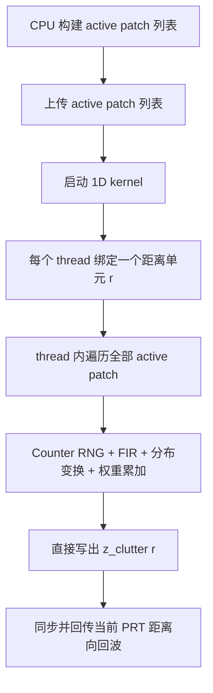
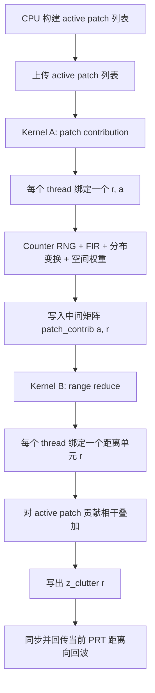
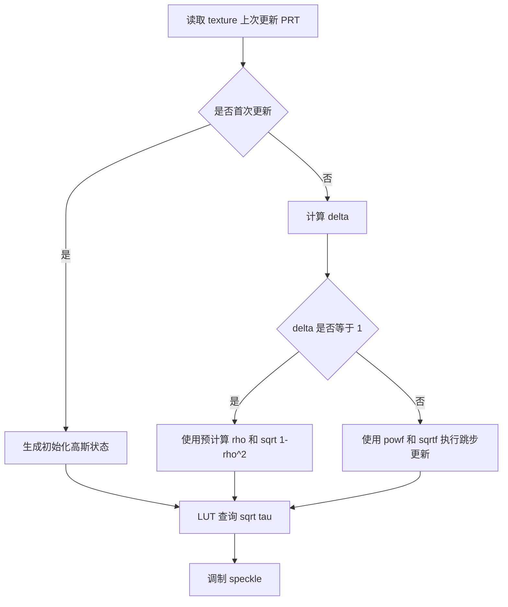
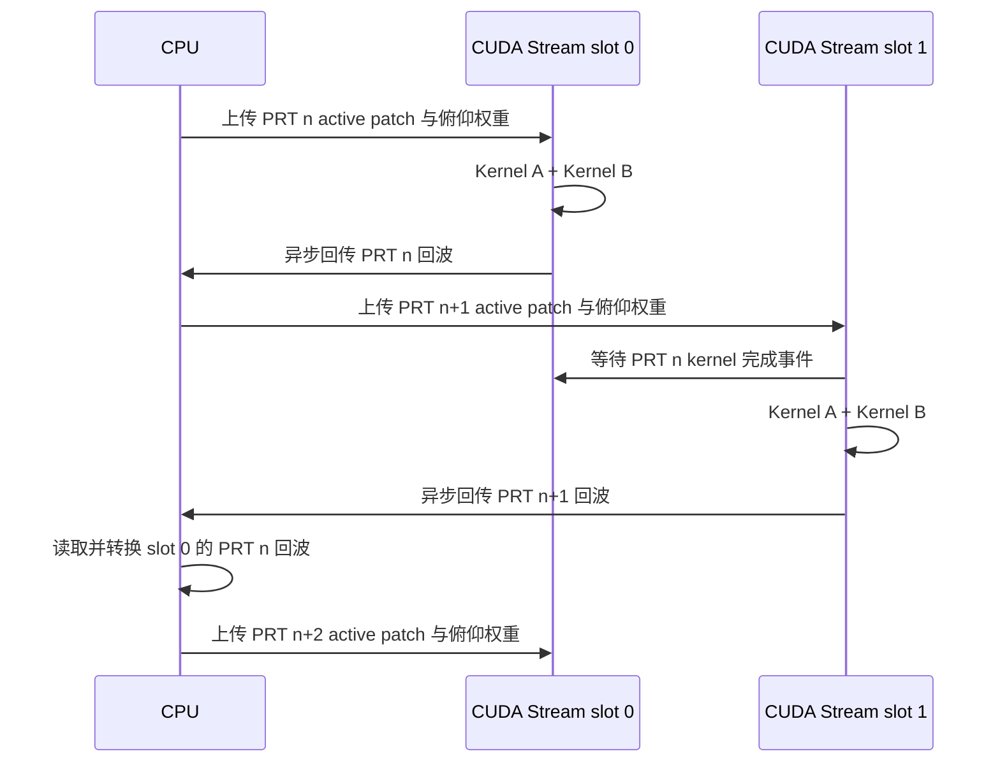

# GPU 海杂波生成并行路径与优化版本对比

## 1. 文档目的

当前 GPU 海杂波引擎保留了四条可对比的执行路径：

1. `1D range-thread`：一维距离并行基线版本。
2. `2D range x patch`：二维距离单元与活动方位 patch 并行版本。
3. `2D-fast`：在二维版本基础上加入 K 分布 texture 连续更新快路径。
4. `stream 2D-fast`：在 `2D-fast` 基础上加入异步双缓冲调度。

这四条路径使用相同的海杂波模型，差别主要在于 GPU 线程映射、K 分布 texture 更新方式以及 CPU 与 GPU 之间的调度方式。保留多个版本的目的不是长期维护多套业务接口，而是通过可复现的对比实验分析瓶颈，确定后续默认实现。

本文说明每条路径的计算流程、优化动机、预期收益、适用条件和测试方法。

## 2. 统一计算模型

设：

- \(N_r\)：距离单元数量。
- \(N_a\)：当前 PRT 的活动方位 patch 数量。
- \(L\)：FIR 滤波器长度。
- \(\mathcal{A}(n)\)：第 \(n\) 个 PRT 的活动方位 patch 集合。
- \(w(r,a,n)\)：由 Counter-based RNG 生成的复白高斯样本。
- \(h[k]\)：根据目标多普勒谱设计并归一化后的 FIR 系数。

对于距离单元 \(r\)、方位 patch \(a\)，首先进行慢时间 FIR 谱成形：

\[
y(r,a,n)=\sum_{k=0}^{L-1} h[k]\,w(r,a,n-k)
\]

然后进行幅度分布变换。将变换函数记为 \(\mathcal{T}(\cdot)\)，则单个 patch 的复回波贡献为：

\[
c(r,a,n)
=A(r,a) \,
G_{\mathrm{el}}(r) \,
G_{\mathrm{az}}(a) \,
\mathcal{T}\!\left(y(r,a,n)\right)
\]

其中：

- \(A(r,a)\)：由后向散射系数、patch 面积、传播损耗和空间 mask 等因素确定的二维 patch 基础幅度。
- \(G_{\mathrm{el}}(r)\)：距离单元对应俯仰角上的天线增益。
- \(G_{\mathrm{az}}(a)\)：当前波束指向下活动方位 patch 的天线增益。

当前 PRT 的距离向杂波复回波为：

\[
z_{\mathrm{clutter}}(r,n)
=\sum_{a\in\mathcal{A}(n)} c(r,a,n)
\]

四条执行路径最终都需要完成上述计算。因此，它们的主要计算复杂度均为：

\[
\mathcal{O}\!\left(N_r N_a L\right)
\]

优化的重点不是改变数学模型，而是提高 GPU 并行度、减少高代价函数调用，并隐藏数据传输与主机端处理开销。

### 2.1 静态幅度图与方向图权重

四条路径共用同一份静态二维幅度图：

```text
patch_amplitude_map[az_idx][range_idx]
```

设备端按 `[az][range]` 排列。对于固定活动方位 patch，相邻距离 thread 读取连续地址，适合 GPU 合并访存。

当前均匀海面模式先计算一条距离向幅度剖面，再沿方位复制到二维图中。后续加入海陆 mask、局部增强区或衰减区时，只需要修改指定二维单元，不改变 kernel 的主流程。

天线方向图权重拆分为：

```text
active_patch.az_amplitude_weight
el_amplitude_weight[range_idx]
peak_amplitude_weight
```

方位权重随当前扫描方位变化，每个 PRT 跟随 active patch 列表上传。俯仰权重按距离单元组织，在波束俯仰变化时更新。

## 3. 总体演进关系


各版本的优化重点如下：

| 路径 | 主要优化对象 | 核心手段 | 是否改变海杂波模型 |
|---|---|---|---|
| `1D` | 基线实现 | 每个线程负责一个距离单元 | 否 |
| `2D` | GPU 线程并行度 | 将 patch 维度展开到 GPU 网格 | 否 |
| `2D-fast` | K 分布 texture 更新开销 | 连续 PRT 使用预计算 AR(1) 系数 | 否 |
| `stream 2D-fast` | 数据传输和调度等待 | 双缓冲、Pinned Memory、异步拷贝、CUDA Stream | 否 |

### 3.1 代码对应关系

| 路径 | GPU 实现文件 | 对外调用入口 | 当前定位 |
|---|---|---|---|
| `1D` | `radar_common/src/cuda/clutter_gpu.cu` | `get_clutter_for_pulse()`、`get_clutter_for_pulse_timed()` | 默认逐 PRT 主路径 |
| `2D` | `radar_common/src/cuda/clutter_gpu_2d.cu` | `get_clutter_for_pulse_timed_2d()` | 二维并行实验路径 |
| `2D-fast` | `radar_common/src/cuda/clutter_gpu_2d_fast.cu` | `get_clutter_for_pulse_timed_2d_fast()` | K texture 快路径实验版本 |
| `stream 2D-fast` | `radar_common/src/cuda/clutter_gpu_stream.cu` | `generate_clutter_sequence_2d_fast_stream()` | 连续 PRT 异步双缓冲实验版本 |

当前业务接口仍以“输入当前波束和 PRT 序号，输出一个 PRT 的距离向杂波复回波”为基本形式。stream 版本为了形成异步流水，额外提供了连续 PRT 序列生成入口，主要用于性能实验和后续数据链路优化验证。

## 4. 一维距离并行路径

### 4.1 线程映射

一维版本使用最直接的 GPU 映射方式：

\[
\text{thread} \longleftrightarrow r
\]

每个 GPU thread 负责一个距离单元，并在 thread 内部串行遍历当前 PRT 的全部活动方位 patch：

\[
z_{\mathrm{clutter}}(r,n)
=\sum_{a\in\mathcal{A}(n)}
A(r,a) G_{\mathrm{el}}(r) G_{\mathrm{az}}(a)
\mathcal{T}\!\left(
\sum_{k=0}^{L-1} h[k]w(r,a,n-k)
\right)
\]



### 4.2 实现特点

- kernel 网格规模约为 \(N_r\) 个 thread。
- 活动 patch 列表在 block 内载入 shared memory，供同一 block 的距离线程复用。
- 每个 thread 内部执行约 \(N_a L\) 次 FIR 复乘加。
- 所有 patch 贡献在寄存器中累计，最终直接写入一个距离单元的输出。
- 不需要额外的 patch contribution 中间缓冲区。

### 4.3 优势

- 实现结构简单，容易验证。
- 只启动一个主 kernel。
- 中间结果不落全局内存，显存访问量较小。
- 当 \(N_r\) 足够大、\(N_a\) 较小时，GPU 已经可以获得较好的利用率。
- 适合作为正确性基线和其他优化版本的对照组。

### 4.4 局限

每个 thread 内部仍然需要串行遍历所有活动 patch。当 \(N_a\) 或 \(L\) 增大时，单个 thread 的执行路径变长：

\[
T_{\mathrm{thread}} \propto N_a L
\]

如果距离单元数量有限，例如 \(N_r \approx 2000\)，可同时调度的 thread 数量也受到限制。对于计算资源较多的 GPU，可能无法充分暴露并行度。

## 5. 二维 range x patch 并行路径

### 5.1 优化动机

一维版本只在距离维度上并行。由于不同方位 patch 的贡献也可以独立计算，因此可以将 patch 维度进一步展开：

\[
\text{thread} \longleftrightarrow (r,a)
\]

二维版本将原本位于 thread 内部的 patch 循环拆分为大量独立 thread，再通过第二个 kernel 对同一距离单元的 patch 贡献进行归约。

### 5.2 两阶段计算流程

第一阶段计算每个 \((r,a)\) 对应的单 patch 贡献：

\[
c(r,a,n)
=A(r,a) G_{\mathrm{el}}(r) G_{\mathrm{az}}(a)
\mathcal{T}\!\left(
\sum_{k=0}^{L-1}h[k]w(r,a,n-k)
\right)
\]

第二阶段按距离单元进行相干叠加：

\[
z_{\mathrm{clutter}}(r,n)
=\sum_{a\in\mathcal{A}(n)}c(r,a,n)
\]



### 5.3 线程规模变化

一维路径的并行 thread 数量约为：

\[
N_{\mathrm{thread,1D}} \approx N_r
\]

二维路径第一阶段的并行 thread 数量约为：

\[
N_{\mathrm{thread,2D}} \approx N_r N_a
\]

例如：

\[
N_r=2000,\qquad N_a=36
\]

则第一阶段可展开约：

\[
2000\times36=72000
\]

个独立计算任务。

### 5.4 额外成本

二维并行并不是无代价的。它引入了中间贡献矩阵：

\[
\mathbf{C}\in\mathbb{C}^{N_a\times N_r}
\]

其显存开销约为：

\[
M_{\mathrm{contrib}}
=N_a N_r \cdot \operatorname{sizeof}(\texttt{DeviceComplex})
\]

同时增加了：

- 一次中间结果全局内存写入。
- 一次中间结果全局内存读取。
- 一个额外的 reduce kernel。
- 额外的 kernel launch 开销。

### 5.5 预期收益

二维路径适合以下情况：

- \(N_r\) 较小，单独展开距离维度不足以填满 GPU。
- \(N_a\) 较大，例如方位 patch 网格更细或方向图门限更低。
- FIR 长度 \(L\) 较大，单个 \((r,a)\) 任务具有足够计算量。
- GPU 计算能力较强，中间显存访问不是主要瓶颈。

二维路径的收益不一定很大。若一维版本已经可以充分利用 GPU，或者当前平台受限于随机数生成、非线性函数、显存带宽、回传开销，则新增 patch 维并行只能获得有限提升。

已有 GT 1030 初步测试中，二维路径相对一维路径约提升 `1.03x`。这说明二维拆分在低端 GPU 上可以带来小幅收益，但当前瓶颈并不只是 thread 数量不足。正式论文实验仍应在目标平台上使用多圈测试重新测量。

## 6. 2D-fast：K 分布 texture 连续更新快路径

### 6.1 优化对象

`2D-fast` 保持二维 range x patch 线程映射不变，专门优化 K 分布 texture 的 AR(1) 更新。

K 分布杂波使用慢变 texture 调制 speckle。设 texture 对应的高斯驱动状态为 \(x(r,a,n)\)，当某个 patch 距离上一次更新间隔为 \(\Delta\) 个 PRT 时，跳步更新公式为：

\[
x(r,a,n)
=\rho^\Delta x(r,a,n-\Delta)
+\sqrt{1-\rho^{2\Delta}}\,e(r,a,n)
\]

其中：

\[
e(r,a,n)\sim\mathcal{N}(0,1)
\]

随后通过 LUT 将高斯状态映射为 Gamma texture 幅度：

\[
\sqrt{\tau(r,a,n)}
=\operatorname{LUT}\!\left(x(r,a,n)\right)
\]

最终得到 K 分布 patch：

\[
c_K(r,a,n)
=\sqrt{\tau(r,a,n)}\,c_{\mathrm{speckle}}(r,a,n)
\]

### 6.2 二维普通版本的处理方式

普通 `2D` 路径对任意 \(\Delta>0\) 都执行：

\[
\rho_\Delta=\rho^\Delta
\]

\[
\sigma_\Delta=\sqrt{1-\rho_\Delta^2}
\]

这意味着每次更新都可能调用 `powf` 和 `sqrtf`。

### 6.3 快路径

机械扫描过程中，一个已经进入活动窗口的 patch 通常会连续多个 PRT 保持活动状态，因此大多数更新满足：

\[
\Delta=1
\]

对于连续 PRT，可以直接使用初始化阶段预计算的常量：

\[
x(r,a,n)
=\rho\,x(r,a,n-1)
+\sqrt{1-\rho^2}\,e(r,a,n)
\]

`2D-fast` 对 \(\Delta=1\) 使用上述快路径，避免重复执行 `powf` 和 `sqrtf`。当 patch 刚进入活动窗口，或者中间存在跳步时，仍然保留通用公式：

\[
x(r,a,n)
=\rho^\Delta x(r,a,n-\Delta)
+\sqrt{1-\rho^{2\Delta}}\,e(r,a,n)
\]



### 6.4 预期收益

`2D-fast` 的收益具有明确边界：

- 对 K 分布有效，因为优化对象是 texture AR(1) 更新。
- 对 Rayleigh、Weibull 和 LogNormal 分布，计算流程与普通 `2D` 基本相同，预期性能接近。
- 活动 patch 连续驻留时间越长，\(\Delta=1\) 的比例越高，收益越明显。
- K texture 更新占总耗时比例越高，收益越明显。
- 若主要瓶颈来自 FIR、RNG 或主机回传，则总体提升会受到限制。

因此，`2D-fast` 应重点使用 K 分布进行对比测试。

## 7. stream 2D-fast：异步双缓冲路径

### 7.1 优化动机

同步 `2D-fast` 每个 PRT 都按照以下顺序执行：

1. CPU 构建活动 patch 列表。
2. CPU 将活动 patch 上传到 GPU。
3. GPU 执行 contribution kernel 和 reduce kernel。
4. CPU 等待 GPU 完成。
5. GPU 将当前 PRT 回波回传到 CPU。
6. CPU 执行格式转换。
7. 开始下一个 PRT。

该流程中，CPU、GPU 和数据传输之间存在串行等待。stream 版本使用两个缓冲 slot，将连续 PRT 的部分操作重叠执行。

### 7.2 双缓冲资源

stream 版本为 `slot 0` 和 `slot 1` 分别分配：

- 设备端活动 patch 缓冲区 `d_active_patches[2]`。
- 设备端 patch contribution 缓冲区 `d_patch_contrib[2]`。
- 设备端距离向回波缓冲区 `d_echo[2]`。
- 设备端距离向俯仰幅度权重 `d_el_amplitude_weight[2]`。
- 主机端 Pinned Memory 活动 patch 缓冲区 `h_active_patches[2]`。
- 主机端 Pinned Memory 俯仰幅度权重 `h_el_amplitude_weight[2]`。
- 主机端 Pinned Memory 回波缓冲区 `h_echo[2]`。
- 两个 Non-blocking CUDA Stream。
- kernel 完成事件与回传完成事件。

Pinned Memory 使 `cudaMemcpyAsync` 可以真正异步执行。双缓冲则允许当前 slot 计算时，另一 slot 完成数据回传或主机端转换。

### 7.3 调度流程



### 7.4 为什么仍然保持 kernel 顺序

K 分布 texture 是跨 PRT 的有状态 AR(1) 过程。第 \(n+1\) 个 PRT 的 texture 更新依赖第 \(n\) 个 PRT 的状态：

\[
x(r,a,n+1)
=\rho x(r,a,n)
+\sqrt{1-\rho^2}\,e(r,a,n+1)
\]

因此，相邻 PRT 的 texture kernel 不能无约束地并发执行。stream 版本通过 CUDA Event 建立依赖关系，使第 \(n+1\) 个 PRT 的 kernel 等待第 \(n\) 个 PRT 的 kernel 完成。

stream 版本能够重叠的主要是：

- 下一 PRT 的活动 patch 上传。
- 下一 PRT 的距离向俯仰权重上传。
- 上一 PRT 的回波下载。
- CPU 侧活动 patch 列表构建。
- CPU 侧回波格式转换。

它并不强行并发执行具有 texture 状态依赖的相邻 PRT kernel。

### 7.5 预期收益

stream 路径适合以下情况：

- 连续生成大量 PRT，而不是只生成单个 PRT。
- 主机与设备之间的数据上传、下载开销占比较高。
- CPU 侧活动 patch 构建和回波转换开销不可忽略。
- GPU 具备独立 copy engine，支持数据传输与计算重叠。

收益有限的情况包括：

- kernel 计算时间远大于上传、下载和 CPU 转换时间。
- GPU 平台对异步并发支持较弱。
- 每次仅调用一个 PRT，无法形成流水。
- 后续仍然要求每个 PRT 立即同步返回 CPU，限制了调度空间。

如果后续脉压、MTI/MTD 或检测链路也迁移到 GPU，杂波回波无需每个 PRT 立即回传 CPU，则 stream 路径还有进一步扩展空间。

## 8. 四条路径对比

| 对比项 | `1D` | `2D` | `2D-fast` | `stream 2D-fast` |
|---|---|---|---|---|
| thread 映射 | 一个 thread 对应一个距离单元 | 一个 thread 对应一个距离单元与活动 patch | 与 `2D` 相同 | 与 `2D-fast` 相同 |
| patch 维度 | thread 内串行遍历 | 展开到 GPU 网格 | 展开到 GPU 网格 | 展开到 GPU 网格 |
| 输出方式 | 直接写距离向回波 | contribution 中间矩阵 + reduce | contribution 中间矩阵 + reduce | 双 slot contribution 中间矩阵 + reduce |
| 主 kernel 数量 | 1 | 2 | 2 | 每个 PRT 仍为 2 |
| K texture 更新 | 通用跳步公式 | 通用跳步公式 | 连续 PRT 快路径 + 跳步回退 | 连续 PRT 快路径 + 跳步回退 |
| H2D / D2H | 同步 | 同步 | 同步 | `cudaMemcpyAsync` |
| 主机内存 | 普通内存 | 普通内存 | 普通内存 | Pinned Memory |
| CUDA Stream | 默认 stream | 默认 stream | 默认 stream | 双 Non-blocking Stream |
| 相邻 PRT kernel | 串行调用 | 串行调用 | 串行调用 | 通过 Event 显式保持顺序 |
| 主要目的 | 正确性和性能基线 | 增加并行度 | 降低 K texture 更新成本 | 隐藏传输和主机端处理开销 |

## 9. 性能提升的合理预期

### 9.1 不能简单叠加加速比

四条路径并不是相互独立的优化开关。总体耗时可以近似拆分为：

\[
T_{\mathrm{total}}
=T_{\mathrm{active}}
+T_{\mathrm{upload}}
+T_{\mathrm{kernel}}
+T_{\mathrm{download}}
+T_{\mathrm{convert}}
\]

- `2D` 主要尝试降低 \(T_{\mathrm{kernel}}\) 中并行度不足造成的等待。
- `2D-fast` 主要降低 K 分布下 \(T_{\mathrm{kernel}}\) 中 texture 更新部分的开销。
- `stream 2D-fast` 主要通过重叠执行隐藏部分 \(T_{\mathrm{upload}}\)、\(T_{\mathrm{download}}\)、\(T_{\mathrm{convert}}\) 和 CPU 调度开销。

因此，总加速比受到未优化部分的限制，不能将各阶段局部收益直接相乘。

### 9.2 预期趋势

| 场景 | 预期表现 |
|---|---|
| Rayleigh，\(N_a\) 较小，\(L\) 较短 | `1D` 可能已经足够，`2D` 收益有限 |
| 方位网格更细，\(N_a\) 增大 | `2D` 相对 `1D` 更有机会获得收益 |
| FIR 长度增大 | `2D` 可暴露更多独立 patch 任务，但 RNG 和 FIR 本身仍可能成为瓶颈 |
| K 分布，活动 patch 连续更新 | `2D-fast` 相对 `2D` 更有价值 |
| 连续生成多圈 PRT | stream 版本更容易摊薄初始化成本并形成流水 |
| 后续处理继续留在 GPU | 可减少 D2H 回传，stream 扩展收益更大 |

## 10. 基准程序与测试命令

### 10.1 `1D`、`2D`、`2D-fast` 对比

使用：

```bash
./out/bin/benchmark_clutter_gpu_2d \
  2000 10 0.5 -40 25 1600 60 \
  3 1.5 1.2 -0.5 0.5 1.0 2.0 4096
```

其中：

- `2000`：距离单元数量。
- `10`：测试圈数。
- `0.5`：方位 patch 步长，单位为度。
- `-40`：活动 patch 天线增益门限，单位为 dB。
- `25`：FIR 长度。
- `1600`：PRF，单位为 Hz。
- `60`：天线旋转速度，单位为度每秒。
- `3`：K 分布。
- 后续参数依次为 Weibull、LogNormal、K 分布参数和 K texture LUT 长度。

程序输出：

```text
1D range-thread path
2D range_patch path
2D fast range_patch path
speedup_2d_vs_1d
speedup_2d_fast_vs_1d
speedup_2d_fast_vs_2d
```

### 10.2 同步 `2D-fast` 与 stream `2D-fast` 对比

使用：

```bash
./out/bin/benchmark_clutter_gpu_stream \
  2000 10 0.5 -40 25 1600 60 \
  3 1.5 1.2 -0.5 0.5 1.0 2.0 4096
```

程序输出：

```text
sync 2D-fast path
stream 2D-fast double-buffer path
speedup_stream_vs_sync
```

### 10.3 建议实验矩阵

正式实验建议至少覆盖以下变量：

| 变量 | 建议取值 |
|---|---|
| 距离单元数 \(N_r\) | `2000`、`4000` |
| 方位 patch 步长 | `0.5`、`0.25`、`0.2` 度 |
| FIR 长度 \(L\) | `13`、`25`、`37` |
| 分布类型 | Rayleigh、K |
| 测试圈数 | 快速测试 `1` 圈，正式统计 `10` 圈，稳定性测试 `30` 圈 |

重点记录：

```text
avg_us_per_prt
generated_prt_per_sec
realtime_ratio
avg_active_build_us
avg_active_upload_us
avg_kernel_sync_us
avg_d2h_copy_us
avg_host_convert_us
avg_gpu_call_total_us
checksum
```

## 11. 正确性验证要求

优化版本必须保持海杂波模型一致。性能对比前，应先检查：

1. 使用相同 seed、相同波束序列和相同配置。
2. 比较各路径输出 checksum。
3. 对差异较大的情况导出指定 patch 的 IQ 序列。
4. 检查幅度分布直方图和功率谱。
5. 对 K 分布额外检查 texture 的慢变相关特性。

由于浮点计算顺序可能发生变化，优化版本之间不一定要求逐 bit 完全一致，但统计特性、功率谱和总功率应保持一致。若 checksum 差异明显，应优先检查线程映射、K texture 更新顺序和 reduce 逻辑。

## 12. 当前结论与后续方向

当前四条路径形成了由基线到流水调度的完整对比链路：

1. `1D` 用于验证模型和建立性能基线。
2. `2D` 用于研究增加 patch 维并行度是否能够提高 GPU 利用率。
3. `2D-fast` 用于降低 K 分布 texture 连续更新中的高代价函数开销。
4. `stream 2D-fast` 用于隐藏数据传输和主机端处理开销。

后续应在目标平台 Jetson AGX Orin 32G 上使用统一配置完成多圈测试。根据各阶段计时结果，再决定默认路径以及下一步优化重点。若 `avg_kernel_sync_us` 仍占主导，应继续分析 RNG、FIR 和非线性函数；若 `avg_d2h_copy_us` 占比较高，则应优先将后续信号处理链路保留在 GPU，减少逐 PRT 回传。
