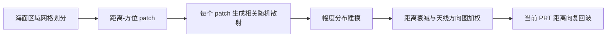
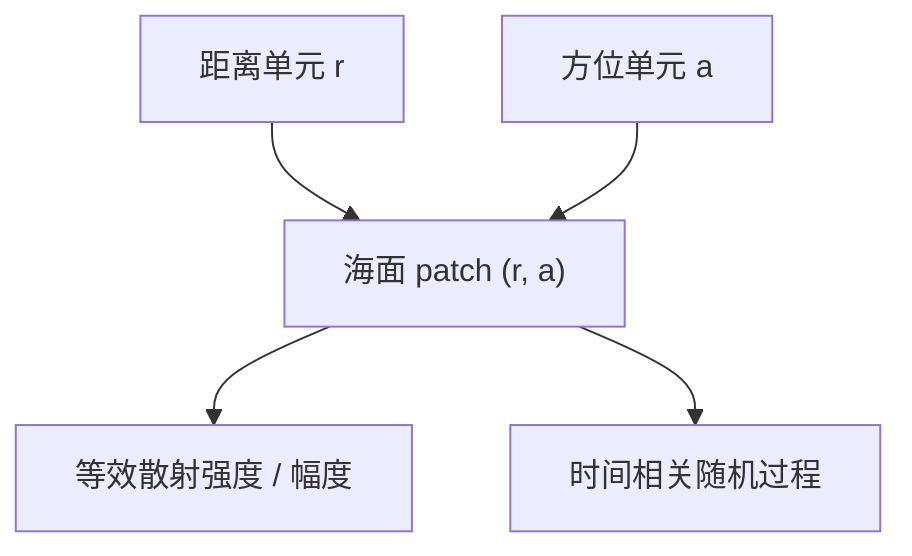
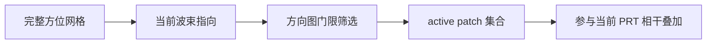
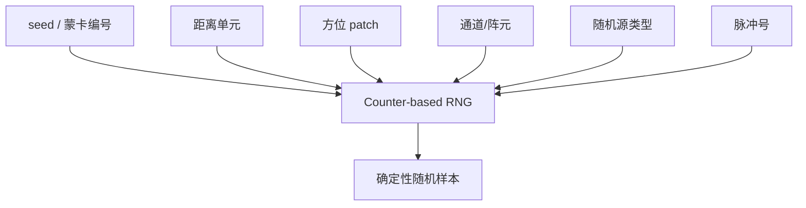
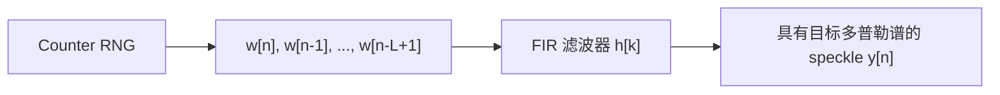
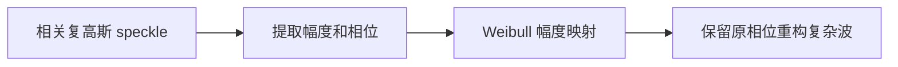
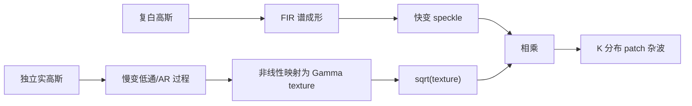
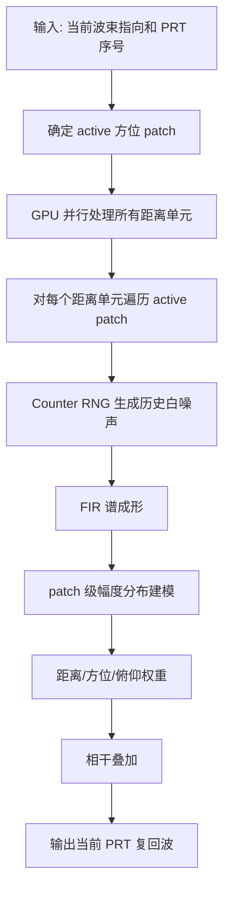
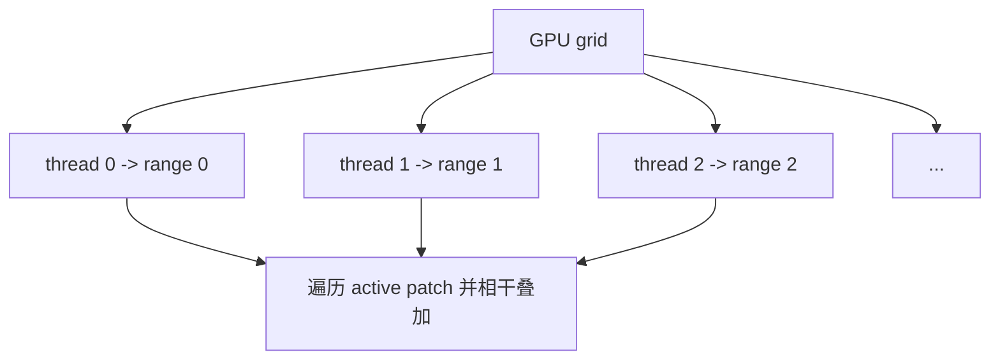

# 基于 Counter-Based RNG 的 GPU 海杂波实时生成方法

## 1. 背景与意义

海杂波是海面散射单元在雷达照射下形成的复杂回波，是舰载、岸基、机载等雷达系统中最重要的环境干扰之一。海杂波具有明显的随机性、相关性和空间非均匀性，其幅度统计、多普勒谱形和空间分布都会影响目标检测、恒虚警处理、动目标显示以及后续跟踪算法的性能。

在雷达系统仿真中，海杂波生成模块需要提供接近真实环境的输入数据。对于扫描雷达而言，每个 PRT 都需要生成一个距离向复回波序列，并随着波束转动形成完整的距离-方位杂波图像。因此，海杂波仿真不仅要满足统计模型正确，还必须满足实时性和可复现性要求。

本方法面向按 PRT 实时生成的雷达仿真场景，采用 **海面网格划分 + Counter-based 随机数 + GPU 并行计算** 的方式，在每个 PRT 直接生成当前波束照射下的海杂波回波。其目标是避免大规模预生成和大量状态缓存，在保证统计特性的同时提高实时生成能力。

## 2. 海杂波仿真的主要困难

海杂波仿真通常同时面临以下问题：

1. **空间维度大**  
   一圈扫描包含大量方位位置，每个方位又包含数千个距离单元。若进一步划分海面散射单元，计算量随距离、方位和脉冲数快速增长。

2. **时间相关性要求高**  
   海杂波不是独立白噪声。其慢时间序列需要满足指定多普勒谱，例如窄带高斯谱或其他经验谱。

3. **幅度分布可能为非高斯重尾分布**  
   实测海杂波常表现出 Weibull、LogNormal、K 分布等非高斯特性。尤其在低擦地角、高海况或高分辨率条件下，重尾特性更明显。

4. **实时性压力大**  
   如果每个 PRT 都遍历所有距离、所有方位和较长 FIR 滤波器，CPU 串行计算难以满足实时要求。

5. **可复现和调试困难**  
   雷达仿真需要能够复现某个指定 PRT、指定距离单元、指定方位单元的随机结果。传统递推随机序列在跳转和局部复现时不够方便。

## 3. 传统方法及其局限

### 3.1 完整预生成方法

一种直接方法是在仿真开始前预先生成完整的杂波数据：

```text
clutter(range, azimuth, pulse)
```

运行时只需按当前波束和距离读取对应数据。这种方法实现简单，离线分析方便，但数据量巨大。当距离单元、方位单元、扫描圈数或蒙卡次数增加时，存储压力迅速上升，并且不利于在线改变海况、谱宽、分布参数等模型配置。

### 3.2 公共长序列随机起点读取方法

另一类常见方法是先生成一条或少量具有指定谱形的长杂波序列，然后不同距离单元使用不同随机起始位置进行读取：

```text
range cell r:
    c_r[n] = long_sequence[n + offset_r]
```

这种方法的优点是实现简单、计算量较低，也容易保证单条序列的功率谱形。它的问题在于：

- 多个距离单元本质上来自同一条或少数几条序列，只是读取起点不同。
- 距离单元之间可能引入非物理的相关结构。
- 当仿真时间较长或起点间隔不足时，可能出现序列片段重复或相关性偏强。
- 难以自然扩展到“每个海面 patch 都具有独立随机散射”的物理建模方式。

这种方法更像是一种快速工程近似，而不是严格的空间散射单元仿真。

### 3.3 状态递推方法

状态递推方法为每个距离-方位散射单元维护滤波状态，通过 FIR 或 IIR 递推产生相关杂波。该方法符合时间序列生成思路，但当海面划分较细时，需要保存大量历史状态。例如 FIR 方法需要保存每个散射单元的历史白噪声或滤波状态，状态量约为：

```text
N_range x N_az x filter_length
```

当距离单元数、方位单元数和滤波器长度较大时，显存或内存占用会成为主要限制。并且如果需要直接复现第 `n` 个 PRT，通常需要从初始状态递推到该时刻。

## 4. 本方法的基本思想

本方法把海杂波看作由多个海面散射 patch 的回波相干叠加而成。每个 patch 具有独立的随机散射过程，并根据雷达距离、天线方向图和当前波束指向进行加权。

总体思想如下：



与传统预生成或长序列读取方法不同，本方法不预先保存完整杂波序列，也不为 speckle 保存长延迟线，而是通过 counter-based RNG 按需直接生成任意散射单元在任意脉冲时刻的随机样本。

## 5. 网格映像法与海面单元划分

### 5.1 距离-方位网格

雷达观测海面可离散为距离和方位两个维度：

```text
range index r = 0, 1, ..., N_r-1
azimuth index a = 0, 1, ..., N_az-1
```

其中，距离维由雷达采样率、脉冲宽度和距离分辨率决定；方位维使用固定角度步长划分：

```text
Delta theta_patch
```

每个 `(r, a)` 对应一个海面散射 patch。该 patch 表示某个距离环带和方位扇区内海面散射的等效贡献。



这种网格映像方式将连续海面映射为规则的距离-方位散射单元，使得杂波生成可以分解为多个 patch 的独立随机过程和空间加权叠加。

### 5.2 当前波束下的 active patch

虽然海面全图都可以存在杂波，但某个 PRT 中实际对回波贡献显著的主要是当前波束覆盖附近的方位 patch。根据当前波束指向和方位方向图，可以筛选出 active patch 集合：

```text
Omega(n) = { a | G_az(a, theta_beam(n)) > threshold }
```

这样每个 PRT 不需要遍历全部方位单元，而只对当前波束附近的方位 patch 进行叠加。该思想符合雷达波束照射的物理过程，也降低了计算量。



### 5.3 patch 回波加权

每个 patch 的贡献由以下因素共同决定：

- 该距离处的海面散射强度。
- 传播距离和雷达方程相关的幅度衰减。
- 当前波束方位方向图增益。
- 当前距离单元对应俯仰方向图增益。
- 该 patch 的随机散射复包络。

因此，某个距离单元当前 PRT 的海杂波可理解为：

```text
当前距离单元回波 = 多个 active 方位 patch 的复数相干叠加
```

这种“先对每个 patch 建模，再相干叠加”的方式比“最终距离单元统一做一次非线性分布变换”更合理，因为非高斯分布应属于海面散射单元本身，而不是叠加后的总回波后处理。

## 6. Counter-Based RNG 方法

### 6.1 基本思想

传统随机数生成器通常依赖递推状态：

```text
x[n+1] = f(x[n])
```

若要得到第 `n` 个样本，必须从前面的状态一步步推进。Counter-based RNG 则不同，它直接把样本索引作为输入：

```text
random_sample = RNG(seed, counter)
```

也就是说，随机数由“这个随机变量是谁”唯一决定。对于海杂波仿真，可以把以下索引编码到 counter 中：

- 距离单元编号
- 方位 patch 编号
- 通道或阵元编号
- 随机源类型
- 脉冲或快拍编号

这样任意一个 patch 在任意 PRT 的随机样本都可以直接计算，不需要保存该 patch 的历史白噪声序列。

### 6.2 随机变量索引设计

本方法将随机变量组织为：

```text
随机样本 = F(蒙卡编号, 距离单元编号, 方位单元编号, 通道编号, 随机源编号, 脉冲编号)
```

其中：

- 蒙卡编号用于区分不同试验或不同仿真场景。
- 距离单元编号用于区分不同距离采样位置。
- 方位单元编号用于区分不同海面方位 patch。
- 通道编号为阵元或接收通道预留。
- 随机源编号用于区分 speckle、texture、热噪声、目标起伏等不同随机过程。
- 脉冲编号用于标识当前或历史 PRT。



这种设计有两个优点：

1. **可复现**：记录索引即可复现任意随机样本。
2. **可并行**：不同线程可以独立计算不同距离和方位单元的随机样本，不存在随机状态竞争。

### 6.3 随机源划分

海杂波中不同随机过程需要使用相互独立的随机流，例如：

- speckle 白复高斯随机源。
- K 分布 texture 初始状态随机源。
- K 分布 texture 动态更新随机源。
- 后续可扩展的热噪声随机源。
- 后续可扩展的目标起伏随机源。

这些随机源通过随机源编号区分，在同一个蒙卡编号下仍能保持独立可复现。

## 7. 单 patch 时间相关建模

### 7.1 复高斯 speckle

每个海面 patch 的基础随机过程从复白高斯序列开始。复白高斯样本的实部和虚部相互独立，均值为零，并具有相同方差。若直接使用该复高斯序列，其幅度服从瑞利分布，功率服从指数分布。

### 7.2 多普勒谱成形

海杂波在慢时间上具有相关性，表现为一定宽度的多普勒功率谱。为了生成具有指定谱形的 patch 序列，可将复白高斯序列通过线性滤波器：

```text
相关 speckle = FIR filter * 复白高斯序列
```

即：

```text
y[n] = sum_k h[k] w[n-k]
```

其中 `h[k]` 为根据目标多普勒谱设计的滤波器系数。由于白噪声样本可由 counter 直接得到，历史项 `w[n-k]` 不需要保存，可在计算当前 PRT 时按需生成。



## 8. 幅度分布建模

本方法支持多种海杂波幅度分布，包括：

- 瑞利分布
- Weibull 分布
- 对数正态分布
- K 分布

### 8.1 瑞利分布

瑞利分布是复高斯杂波的自然结果。复白高斯序列经过单位功率归一化的谱成形滤波后，其幅度仍服从瑞利分布。该模型适合描述散射单元数量较多、中心极限定理近似成立的情况。

### 8.2 Weibull 分布

Weibull 分布可通过零记忆非线性变换得到。其基本思想是保留复高斯序列的相位，仅对幅度进行非线性映射，使最终幅度满足 Weibull 分布。



Weibull 分布能够描述比瑞利分布更灵活的幅度统计特性，适合经验拟合不同海况下的杂波幅度。

### 8.3 对数正态分布

对数正态分布同样可通过零记忆非线性变换构造。使用高斯变量生成对数正态幅度，并保留原复相位：

```text
幅度 = exp(高斯变量)
相位 = 原复高斯相位
```

该模型适合描述幅度呈乘性随机变化的场景。

### 8.4 K 分布

K 分布常用于描述高分辨率、低擦地角或重尾海杂波。其物理解释可视为：

```text
K 分布杂波 = 慢变 texture x 快变 speckle
```

其中 speckle 表示小尺度散射的复高斯起伏，texture 表示较大尺度海面散射强度的慢变调制。生成流程如下：



texture 的慢变过程可用低通滤波或 AR 模型实现，再通过查找表将标准高斯变量映射为 Gamma 分布变量。这样既能保持 K 分布的重尾幅度统计，又能控制 texture 的时间相关性。

## 9. GPU 实时生成流程

### 9.1 每个 PRT 的处理流程

每个 PRT 的处理过程可以概括为：



### 9.2 GPU 线程映射

本方法采用距离维并行：

```text
一个 GPU thread 负责一个距离单元
```

每个线程内部遍历当前 PRT 的 active patch。不同距离单元之间相互独立，因此非常适合 GPU 并行处理。



### 9.3 算法伪代码

```text
for each PRT n:
    compute beam pointing
    find active azimuth patches

    parallel for each range cell r on GPU:
        echo[r] = 0

        for each active patch a:
            y = 0

            for each FIR tap k:
                w = RNG(seed, r, a, source=speckle, pulse=n-k)
                y += h[k] * w

            c = amplitude_distribution_transform(y)
            weight = range_weight(r) * antenna_weight(r, a)
            echo[r] += weight * c

    output echo[0 ... N_range-1]
```

K 分布模式下，`amplitude_distribution_transform(y)` 替换为：

```text
texture = slow_texture_process(r, a, n)
c = sqrt(texture) * y
```

## 10. 正确性验证思路

### 10.1 单 patch 幅度分布验证

固定一个距离单元和方位 patch，连续生成大量慢时间样本，统计其幅度直方图，并与理论分布或参数估计结果对比：

- 瑞利分布：验证实部、虚部均值约为零，方差一致，功率近似指数分布。
- Weibull 分布：验证幅度直方图与 Weibull PDF 一致。
- 对数正态分布：验证幅度对数的均值和方差。
- K 分布：验证幅度重尾特性和 K 分布拟合结果。

### 10.2 多普勒谱验证

对单 patch 的 IQ 时间序列进行功率谱估计，检查其主谱形是否与设定多普勒谱一致。该验证用于证明 FIR 谱成形正确。

### 10.3 PPI 图像验证

生成完整一圈扫描数据，将距离-方位功率显示为 PPI 图像。检查内容包括：

- 杂波是否覆盖预期距离和方位区域。
- 波束扫描是否形成合理的方位照射结构。
- 不同幅度分布下是否表现出不同的强散射点和重尾特征。

### 10.4 可复现性验证

固定 seed、距离单元、方位单元和 PRT 序号，多次生成应得到一致结果；改变任一索引或随机源类型，结果应发生变化。这是 counter-based RNG 方法的重要验证。

## 11. 性能评价指标

实时生成能力主要通过以下指标评价：

| 指标 | 含义 |
|---|---|
| 平均单 PRT 生成时间 | 每个 PRT 从输入波束到输出距离向回波的平均耗时 |
| 每秒可生成 PRT 数 | 衡量生成吞吐能力 |
| 实时倍率 | 仿真时间与实际运行时间之比 |
| active patch 数量 | 影响每个距离单元需要叠加的方位 patch 数 |
| FIR 长度 | 影响每个 patch 的时间相关滤波计算量 |
| 距离单元数量 | 影响 GPU 并行线程数量 |

在典型测试条件下，例如约 2000 个距离单元、一圈约 9600 个 PRT、入门级 GPU，当前方法已经可以达到接近或超过实时的生成能力。更高性能 GPU 上会有更大实时余量。

## 12. 方法优势

### 12.1 避免大规模预生成

本方法不需要预先保存完整的距离-方位-时间杂波数据，减少了存储占用，也便于改变仿真参数。

### 12.2 避免 speckle 长状态缓存

FIR 需要历史白噪声样本，但这些历史样本可由 counter 直接计算，因此不需要为每个 patch 保存完整 delay line。

### 12.3 天然适合并行计算

不同距离单元之间相互独立，GPU 可以并行计算所有距离单元。当前 PRT 的 active patch 集合在多个线程之间共享，适合 GPU 批量处理。

### 12.4 可复现性强

随机样本由 seed 和物理索引确定，便于复现实验、调试单元问题和进行蒙卡对比。

### 12.5 分布扩展自然

本方法在 patch 级别进行幅度分布建模，然后再进行雷达方向图和距离权重下的相干叠加。这种组织方式适合扩展不同幅度分布和海况模型。

## 13. 与传统方法对比

| 对比项 | 完整预生成 | 长序列随机起点读取 | 状态递推方法 | 本方法 |
|---|---|---|---|---|
| 数据存储 | 很大 | 较小 | 中到大 | 小 |
| 单元独立性 | 可实现但代价高 | 较弱 | 较强 | 较强 |
| 时间相关性 | 可控 | 取决于长序列 | 可控 | 可控 |
| 随机访问任意 PRT | 依赖预生成数据 | 较方便但受序列限制 | 不方便 | 方便 |
| 实时性 | 读取快但准备成本高 | 较好 | 取决于状态规模 | 较好 |
| GPU 并行适配 | 一般 | 一般 | 中等 | 强 |
| 非高斯分布扩展 | 需重新生成 | 受长序列限制 | 可扩展 | 可扩展 |

## 14. 当前方法本身的权衡与问题

本方法虽然避免了大规模预生成和 speckle 状态缓存，但仍存在一些方法层面的权衡：

1. **计算换存储**  
   历史白噪声不保存，而是在需要时重新计算。这降低了存储量，但增加了每个 PRT 内的随机数计算量。

2. **FIR 长度影响实时性**  
   多普勒谱越窄，通常需要更长的滤波器来逼近目标谱形，计算量随 FIR 长度线性增加。

3. **active patch 数量影响计算量**  
   方位网格越密、方向图门限越低，每个 PRT 参与叠加的 patch 越多，计算量越大。

4. **K 分布 texture 仍需慢变状态**  
   K 分布为了保持 texture 的时间相关性，需要保存每个 patch 的慢变 texture 状态。该状态远小于 FIR delay line，但并非完全无状态。

5. **模型精度依赖单元划分**  
   方位 patch 步长、距离单元大小和方向图采样方式会影响杂波空间分布精度。网格过粗会损失空间细节，网格过细会增加计算量。

## 15. 后续可扩展方向

后续可以从以下方向继续完善：

1. **更精细的海面散射强度图**  
   引入随地理位置、海况、风向、擦地角变化的二维散射强度图。

2. **更完整的天线方向图表**  
   使用预计算方向图表替代简化方向图模型，支持真实天线方向图和旁瓣结构。

3. **目标、热噪声与杂波统一生成框架**  
   使用相同 counter-based RNG 框架，为热噪声、目标 RCS 起伏、多通道接收提供独立随机源。

4. **GPU 后续信号处理联动**  
   将脉压、MTI/MTD、CFAR 等处理继续放在 GPU 上，减少数据回传，提高整体实时性。

5. **多 GPU 或多流流水线**  
   在更高 PRF、更大距离规模或多波束仿真下，可以通过多流和多 GPU 扩展吞吐。

## 16. 总结

本文方法以海面网格划分为基础，将海杂波建模为多个距离-方位 patch 的随机散射回波相干叠加。通过 counter-based RNG，可以在 GPU kernel 内按需生成任意 patch、任意历史脉冲的白高斯样本，再通过 FIR 滤波形成指定多普勒谱，并在 patch 级别引入瑞利、Weibull、对数正态和 K 分布等幅度模型。

与传统完整预生成、公共长序列随机起点读取和状态递推方法相比，该方法在存储占用、可复现性、并行化能力和模型扩展性方面具有优势。其核心特点可以概括为：

```text
用 counter-based RNG 保证可复现
用 GPU 并行保证实时性
用 patch 级建模保证物理组织合理
用按需生成避免大规模状态和预生成数据
```

因此，该方法适合作为雷达系统级仿真中的实时海杂波生成模块，也为后续扩展目标、噪声、多通道和更复杂海况模型提供了统一框架。
