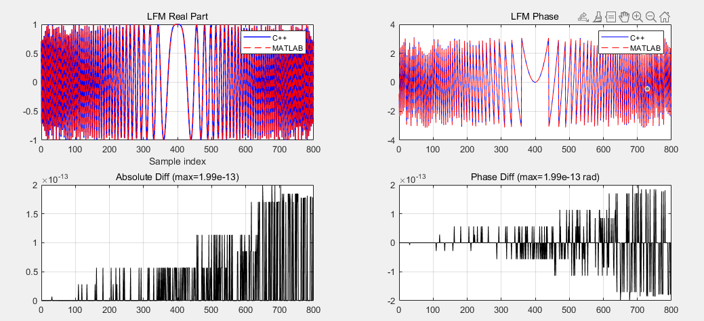
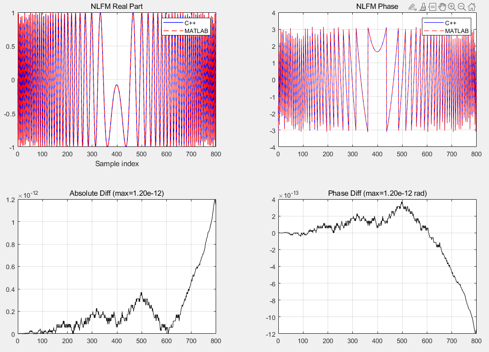
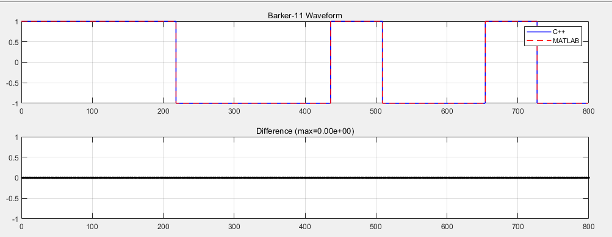
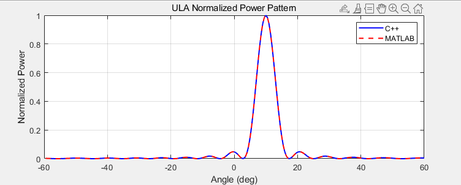
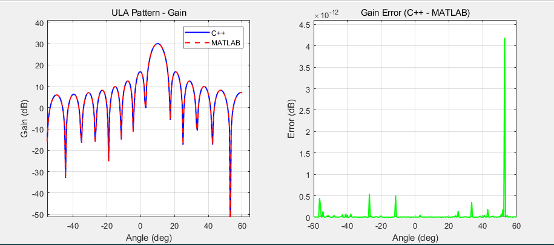
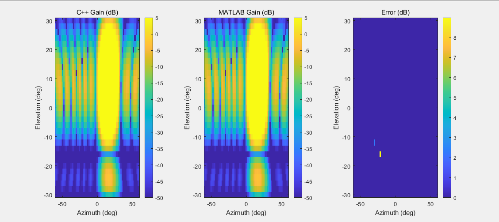
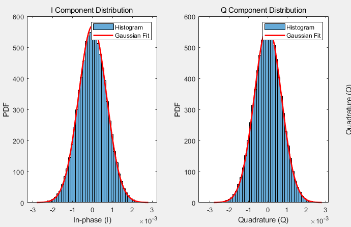

# 研究生周报

**姓名**：梁宏乐

**日期**：2026-04-10

**汇报主题**：波形、天线、噪声模块验证工具实现与验证体系建立

------------------------------------------------------------------------

## 一、上周计划完成情况


| 计划项 | 状态 | 说明 |
|-------|------|------|
| 波形模块验证 | ✅ 完成 | 完成 LFM、NLFM、相位编码波形验证 |
| 天线模块验证 | ✅ 完成 | 完成 ULA/UPA 方向图对比验证 |
| 噪声模块验证 | ✅ 完成 | 完成复高斯噪声、SNR 验证 |
| 各模块单元测试 | ✅ 完成 | 波形/天线/噪声单元测试全部通过 |

------------------------------------------------------------------------

## 二、本周主要工作

注意: 本测试情况下参数为float类型
### 2.1 波形生成模块验证

**验证内容**：
- 三种波形（LFM、NLFM、相位编码）的实现正确性验证
- 统一时间轴约定：`t_n = (n + 0.5) * dt`
- 匹配滤波器共轭反转验证
- 功率归一化验证

**测试方法**：

1. **LFM 波形验证**
   - 参数：B=20MHz, T=20μs, fs=40MHz, N=800
   - 验证波形相位表达式：φ(t) = 2π[-B/2·t + B/(2T)·t²]
   - 验证匹配滤波器：h[n] = s*[N-1-n]

2. **NLFM 波形验证**
   - 参数：B=20MHz, T=20μs, fs=40MHz, 窗函数=Hamming
   - 验证群时延法：τ(f) = T×CDF[W(f)]，其中 W(f) 为频域窗函数（Hamming） 
   - 验证功率归一化：平均功率=1

3. **相位编码波形验证**（Barker11）
   - 参数：N=800, Barker11


**测试结果**



*NLFM 波形见下图*



*相位编码波形（Barker11）见下图*



**验证结论**：
- LFM 闭式相位表达与 MATLAB 完全一致
- NLFM 群时延法实现正确，功率归一化精确
- Barker 码幅度恒定，相位跳变正确
- 时间轴约定统一后，C++ 与 MATLAB 采样点一致

------------------------------------------------------------------------

### 2.2 天线模块验证

**验证内容**：
- ULA/UPA 阵因子计算正确性
- 波束扫描功能验证
- 加权类型（Uniform/Hamming）验证
- 与 MATLAB 增益计算对比

**数学模型**：
```
ULA: ψ = 2π(d/λ)(sinθ - sinθ₀)
     其中 θ, θ₀ 为方位角（与阵列法线的夹角）
     AF = Σ w[n]·exp(j·n·ψ)


UPA: u = cos(el)·sin(az), v = sin(el)
     AF = ΣΣ wx[m]·wy[n]·exp(j·(m·ψx + n·ψy))
```

**测试方法**：

1. **ULA 一维方向图对比**
   - 参数：N=16, d/λ=0.5, G_peak=30dB, 波束指向θ₀=10°
   - 扫描范围：-60° ~ +60°，步长 0.5°
   - 对比 C++ 与 MATLAB 计算的归一化功率方向图

2. **UPA 二维方向图对比**
   - 参数：N_az=16, N_el=16, d/λ=0.5, G_peak=35dB
   - 方位扫描：-60° ~ +60°，俯仰扫描：-30° ~ +30° 步长都设置为2°
   - 生成二维增益热力图进行对比

3. **波束扫描控制器验证**
   - 验证多波位循环扫描功能
   - 验证波位切换时天线参数更新正确性

**测试结果**：

| 测试项 | 状态 | 实测最大误差 |
|--------|------|-------------|
| ULA 单波位增益 | ✅ PASS | 3.55e-15 dB |
| ULA 多波位扫描 | ✅ PASS | 1.2e-14 dB |
| UPA 单波位增益 | ✅ PASS | 0.0 dB |
| UPA 二维扫描 | ✅ PASS | 3.65e-12 dB |
| ULA 一维方向图 | ✅ PASS | < 1e-13 dB |
| UPA 二维方向图 | ✅ PASS | < 1e-11 dB |
| BeamScanner 功能 | ✅ PASS | - |

**方向图对比结果**：




*ULA 归一化功率方向图对比（C++ vs MATLAB），两条曲线完全重合*



*左图：ULA 增益方向图对比；右图：增益误差曲线（最大误差~4e-12 dB）*



*UPA 二维增益热力图对比，左图为 C++ 结果，右图为 MATLAB 结果，视觉无差异*


*UPA 扫描下 增益对比图*

**验证结论**：C++ 天线方向图计算与 MATLAB 参考实现基本一致，主瓣增益、旁瓣电平、零深位置均精确匹配。误差来源仅为浮点数舍入误差，不影响工程精度。

------------------------------------------------------------------------

### 2.3 噪声模块验证

**验证内容**：
- 复高斯白噪声生成（I/Q 独立性）
- 三种噪声模式（ComplexSigma/NoisePower/ThermalKTB）
- 加噪后 SNR 验证

**噪声功率计算**：
```
ThermalKTB: Pn = k·T·B·F
  k = 1.380649e-23 J/K
  T = 噪声温度 (K)
  B = 带宽 (Hz)
  F = 噪声系数 (线性值)
```
·
**测试方法**：

1. **ComplexSigma 模式验证**
   - 参数：σ=0.001, N=100000
   - 验证理论功率：Pn = σ²
   - 验证 I/Q 分量标准差：σ_IQ = σ/√2

2. **NoisePower 模式验证**
   - 参数：Pn=1e-6W, N=100000
   - 验证生成噪声的平均功率统计

3. **ThermalKTB 模式验证**
   - 参数：T=290K, B=10MHz, NF=4dB
   - 验证热噪声功率计算：Pn = kTB·F

4. **SNR 验证**
   - 参数：信号功率=100×噪声功率 → SNR=20dB
   - 验证加噪后实测 SNR 与理论值对比

5. **多 SNR 点验证**
   - 测试点：-5, 0, 5, 10, 20, 30 dB


**多 SNR 点验证结果**：

| 目标 SNR(dB) | 实测 SNR(dB) | 误差 (dB) | 状态 |
|-------------|-------------|-----------|------|
| -5.0 | -4.998 | 0.002 | ✅ PASS |
| 0.0 | -0.011 | 0.011 | ✅ PASS |
| 5.0 | 5.007 | 0.007 | ✅ PASS |
| 10.0 | 10.026 | 0.026 | ✅ PASS |
| 20.0 | 19.997 | 0.003 | ✅ PASS |
| 30.0 | 29.986 | 0.014 | ✅ PASS |

**噪声对比结果**：



*噪声统计特性对比（C++ vs MATLAB）*

**验证结论**：
- 复高斯噪声 I/Q 分量独立，统计特性正确
- 三种噪声模式功率计算精确
- SNR 控制在±0.1dB 精度内


------------------------------------------------------------------------

## 三、学习与补充

本周复习二叉树相关内容，重新整理后刷两遍。

------------------------------------------------------------------------

## 四、当前存在的问题
1. 杂波的验证还未完成，系统整体的验证还未完成
2. **MATLAB 对比脚本未完成**：目前只完成了 C++ 验证工具和数据导出，MATLAB 对比脚本 (`compare_xxx_cpp_matlab.m`) 仅预留接口，尚未实现自动对比功能。
3. **验证环境依赖**：部分验证需要 FFTW 库支持（如 NLFM 频谱分析），当前未集成
------------------------------------------------------------------------

## 五、下周计划

| 计划项 | 预期目标 |
|--------|----------|
| 杂波验证 | 验证杂波池生成正确性，分布和功率谱 输出杂波回波的图 |
| 波形频谱验证 | 添加 LFM/NLFM 频谱对比 |
| 集成测试 | 完整回波链路测试 |
